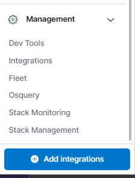
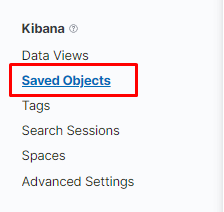
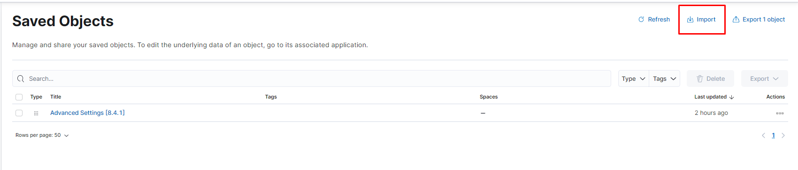
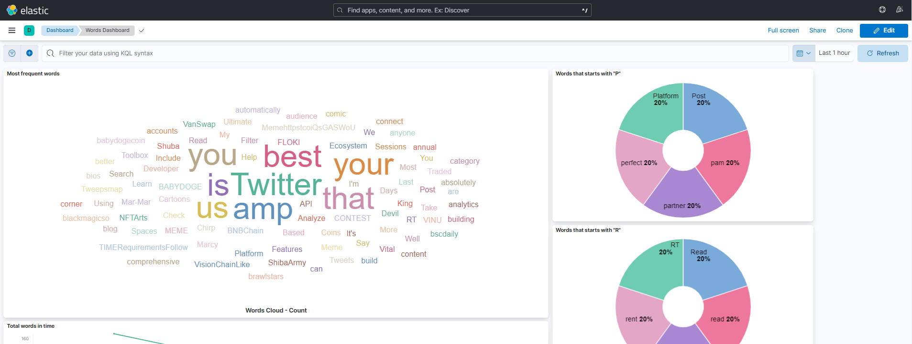

# Projeto Final

Igor Batista Paiva - 18/0018728

## Sobre

Para executar será necessário ter instalado o `docker` e `docker-compose`.

## Configuração

Para instalar todas as dependências e criar todos os elementos necessários utilize o comando abaixo:

```
bash setup.sh
```

### Tweets Twitter

A aplicação pode ler tweets do Twitter, a leitura é feita utilizando autenticação OAuth utilizando as chaves disponibilizadas para acesso a API, a cada 5 segundos é feita uma requisição para buscar os tweets recentes que contêm a hashtag `#meme` e são escritos em inglês (outros critérios poderiam ser utilizados), as mensagens dos tweets são extraídas e enviadas para o tópico no Kafka.

**Para definir a variável de ambiente com o token utilize os comandos abaixo**:

```
docker exec -it discord-kafka-publisher bash

# dentro do container
export TWITTER_API_TOKEN=<PLACE THE TOKEN HERE>
```

### Mensagens Discord

A aplicação pode ler mensagens de um servidor do [Discord](https://discord.com), será necessário colocar um bot com permissões no servidor e então fornecer o token do bot para o container `discord-kafka-publisher`.

Será necessário marcar para o Bot a opção `MESSAGE CONTENT INTENT` e dar as permissões `Read Messages/View Channels`, `Read Message History`.

**Para definir a variável de ambiente com o token utilize os comandos abaixo**:

```
docker exec -it discord-kafka-publisher bash

# dentro do container
export BOT_TOKEN=<PLACE THE TOKEN HERE>
```

O código foi feito seguindo as recomendações da [API do Discord](https://discord.com/developers/docs/intro), autenticação utilizando [OAuth2](https://discord.com/developers/docs/topics/oauth2#shared-resources-oauth2-scopes) e também a biblioteca do Python [discord.py](https://discordpy.readthedocs.io/en/stable/quickstart.html).

## Como executar

Após ter rodado o *setup* com sucesso para iniciar novamente só é necessário subir os containers e seguir os demais passos:

```
docker-compose up -d
```

Os containers sobem em modo *detach*, portanto caso queira ver os logs dos containers utilize:

```
docker-compose logs -f

# ou

docker-compose logs <SERVICE NAME> -f
```

### Iniciar o master e os workers

Será necessário iniciar o spark master e os spark workers:

```
bash start_master_workers.sh
```

Este script simplemente inicia os nós utilizando os scripts do Spark, para os workers é utilizado 1 GB de memória e 1 core.

### Kafka Publishers

#### Iniciar o Twitter publisher

Este script irá buscar tweets e enviará o conteúdo da mensagem para o [Apache Kafka](https://kafka.apache.org/).

Em um novo terminal (a chamada é blocante):

```
docker exec -it twitter-kafka-publisher bash

# dentro do container
python3 -u main.py
```

Para encerrar: `CTRL + C`.

#### Iniciar o Discord publisher

Este script irá escutar a chegada de mensagens no servidor do Discord configurado e enviará o conteúdo da mensagem para o [Apache Kafka](https://kafka.apache.org/).

Em um novo terminal (a chamada é blocante):

```
docker exec -it discord-kafka-publisher bash

# dentro do container
python3 -u main.py
```

Para encerrar: `CTRL + C`.

#### Iniciar o random publisher

O publisher envia eventos para o servidor Kafka a cada um segundo (1 segundo) com um paragrafo de texto gerado aleatoriamente pela biblioteca [essential-generators](https://pypi.org/project/essential-generators/).

Em um novo terminal (a chamada é blocante):

```
docker exec -it random-kafka-publisher bash

# dentro do container
python3 -u main.py
```

Para encerrar: `CTRL + C`.

### Submeter o problema

Em um novo terminal entre no container do spark driver:

```
docker exec -it spark-driver bash
```

Para submeter o programa utilize o comando abaixo, o arquivo txt no final pode ser utilizado para ver a quantidade de mensagens recebidas e filtradas para cada batch.

```
./spark-3.1.3-bin-hadoop3.2/bin/spark-submit --packages org.apache.spark:spark-sql-kafka-0-10_2.12:3.1.3 elastic.py > results.txt
```

## Resultados

Os dados provenientes do Kafka são processados pelo Spark e enviados para o Elasticsearch, esses dados podem ser analisados utilizando o Kibana.

Para acessar a interface gráfica do Kibana acesse http://localhost:5601/.

### Importar o dashboard

#### Passo 1

Na sidebar da interface em `Management` clique em `Stack Management`.



#### Passo 2

Na sidebar em `Kibana` clique em `Saved Objects`.



#### Passo 3

Clique no botão de `import` e selecione o arquivo disponível na pasta `dashboard/export_words_dashboard.ndjson` e marque as opções desejadas.



#### Passo 4

Veja o dashboard na página de Dashboard. `Analytics` => `Dashboard`. Para ver o dashboard ser atualizado com a chegada de novos dados ative o `refresh every` para a quantia desejada.



## Observações

Para facilitar a execução algumas das imagens foram adicionadas ao [Docker Hub](https://hub.docker.com/):

- [Spark master](https://hub.docker.com/repository/docker/igorrunb/spark-master/general)
- [Spark worker](https://hub.docker.com/repository/docker/igorrunb/spark-worker/general)
- [Kafka Server](https://hub.docker.com/repository/docker/igorrunb/kafka-server)
- [Kafka Zookeeper](https://hub.docker.com/repository/docker/igorrunb/kafka-zookeeper)
- [Random Kafka Publisher](https://hub.docker.com/repository/docker/igorrunb/random-kafka-publisher)

Essas imagens são iguais as do projeto de pesquisa anterior e podem ser encontradas [aqui](https://github.com/igor-paiva/spark-streaming-kafka).
